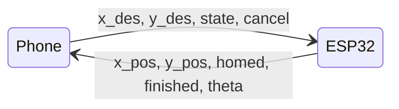
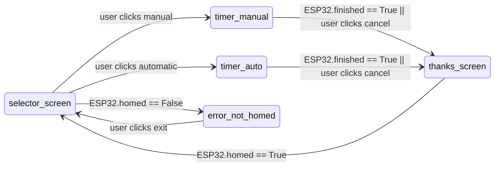
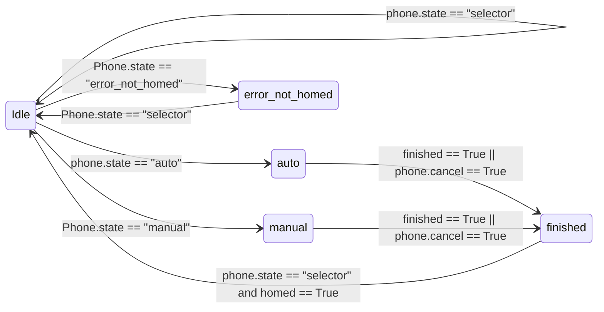

# Soft Serve shipping

[toc]  

# Introduction

SoftServeShipping is an automated crane system designed for the "Design of Microprocessor based mechanical systems" (ME135) class at UC Berkeley.

Project authors: Joy (Tzuyi) Chang, Sam Phillips, Ziven Posner, Tijmen Sep

# Github file structure

- Phone 
    - phone.py
    - src
        - phoneFunction1.py
        - phoneFunction2.py
        - ...
- ESP32
    - ESP32.py
    - src
        - ESP32Function1.py
        - ESP32Function2.py
        - ...
- Deprecated
    - deprecatedFunction1.py
    - deprecatedFucntion2.py
    - ...
- README.md

README.md is a copy of this document (which is linked top github through Hackmd). 

phone.py and ESP23.py represent the most up to date files to be run on demo day. (I.e. these files are to undergo functional testing)

The src folders are not used as traditional src folders (i.e. they are not called at any time during operation on demo day). The src folders contain various functions that the dev team used and tested to create the final phone.py and ESP32.py scripts.

The deprecated file contains all deprecated materials from before we decided on our final devices and file structure. The most major change in development was the removal of a third device, a laptop. The laptop was intedned to perform multithreading via labview, but we realized that it made little sense to artificially add multithreading into the system, and decide to multithread on the ESP32 instead. 

# High level functionality

## Project Goals

Soft Serve Shipping aims to stabilize a shipping container crane using real time programming for the ME135 class. The project CAD can be found here <LINK>. Our mini-shipping crane will allow the user to move a gantry in the x direction, and use a reel to control the height of the shipping container. There are two slots for the container in the base of the crane, corresponding to a 'start' and 'end' position. 

The user will be able to select either an 'automatic' or 'manual' mode. In manual mode, the user is timed on how quickly they can move the container from the start to end positions using a joystick. In the automatic mode, our program is timed performing the same task. All times will be shown on a phone screen after the run is completed.

## Device functionality at a glance

We have two devices running software: a phone (Moto G7 Power, Android 10) and an ESP32. The main functionality of each device is set out briefly below. 

### Phone

- The phone contains the only GUI in this project. It is how the user interacts with the logic of the system. The only other user input is the joystick connected to the ESP32
- The phone presents the user with a choice between 'automatic' or 'manual' , and then shows various data readouts whilst the player or machine performs a run
- In automatic mode, the phone also takes a user input for a desired final position. Whilst this will be defaulted to the 'end' position marked in the crane's base, we will let the litigious types in the room prove for themselves that we didn't hard code one path
- The phone sends the state variable ('automatic' or 'manual') to the ESP32 each run, as well as the desired final location in automatic mode. The phone recieves various positional data from the ESP32 for data readouts. 

### ESP32 

- Regardless of mode, the three primary functions of the ESP32 are: to pull sensor data (X encoder, Y encoder, 4 x Limit Switches, roatary encoder), to send this data to the laptop, and to actuate on motors with a variable PWM value
- In automatic mode, the ESP32 ~~recieves PWM values from the laptop~~ continously computes actuation parameters from the control equation created in MATLAB and current state.
- In manual mode, the ESP32 maps the PWM value linearly to the joystick input

A block diagram showing basic communication flow is shown below.

_Created 3/13/23, Auth: Sam Phillips_  

**------------------Update log ------------------**
- 3/13/23: Added First draft of block diagram using mermaid feature: https://mermaid.js.org/syntax/stateDiagram.html. Added main body text

**--------------------------------------------------**

# Phone Functionality

The phone will show a user interface. At the beginning of each run, the user will be able to select 'manual' or 'automatic' mode. During the run, whether automatic or manual, the phone will show a series of data readouts including current time of run, and maximum angle of displacement. At the end of the run, the GUI will show a short message and then go back to the first screen to select 'manual' or 'automatic' again.

The phone runs python files on a linux distribution called Termux. Termux operates a GUI using the tKinter python library, and VNC viewer as it does not have a graphical interface itself.

The Phone controls a state machine which follows the logic in the diagram below:

The selector screen presents the user with a choice of automatic or manual, as well as showing a score table of the best times so far.

The timer_manual screen shows a timer as the user performs a run, as well as the current angle and maximum angle of deflection.

The timer_auro screen shows a timer as the machine performs a run, as well as the current angle and maximum angle of deflection.

The thanks_screen is presented after the user finishes a run, and shows the time for their run. It holds this screen whilst the machine homes itself, and then goes back to the selector screen.

error_not_homed is an error screen for when the program has been started but the container is not in the homed position. The machine should give control of the gantry to the joystick, so a person can put the container in the correct position and then click exit to go back to the selector screen. 

## Setup:

- Open Termux
- Run: cd testGUI3
    - This takes you into a virtual environment that has all the correct packages installed

- Run: vncsevrer -localhost 
    - This sets up a vncserver. Termux has no GUI, so we use VNCserver as a GUI
- Run: export DISPLAY=':1'

## Classes overview
- gamePlayer
    - Variables:
        - boolean cancel (for cancel button on GUI)
        - int x_des (set by user input in auto mode)
        - int y_des (set by user input in auto mode)
        - float lastRuntime (for use by timer)
        - int maxTheta (maxTheta for current run)
        - string state (current state)
        - string newState (next state)
        - int x_pos (current x position recieved from ESP32)
        - int y_pos (current y position recieved from ESP32)
        - boolean homed (flag to detect if machine is homed recieved from ESP32)
        - boolean finished (flag to detect if run has finished recieved from ESP32)
        - timer runTimer()
        - dictionary frames
        - tk.Frame container
    - init(self)
    - changeState(self,newState) (sets state to newState)
    - updater() (detects if state == newState. Shows frame if True, calls stateChanged() if not) 
    - update(self) (tk inbuilt function, updates the GUI)
    - show_frame(self,page_name) (pulls frame corresponding to 'page_names' in frames{} dict to top of container, hence putting it on show at next call of game.update())
    - updateMaxTheta(self) (updates maxTheta value for given run)

- timer()
    - init(self)
    - startTimer() (sets timeToSubrtract to current time)
    - resetTimer() (sets timeToSubtract to 0)
    - getTime() (subrtracts timeToSubtract from currentTime and returns result)
    - getTimeString() (returns getTime as string formatted "MM:SS")

- select_frame
    - init(self,parent,controller)
    - update(self,time)

- manual_frame
    - init(self,parent,controller)
    - update(self,time)

- automatic_frame
    - init(self,parent,controller)
    - update(self,time)

- thankyou_frame
    - init(self,parent,controller)
    - update(self,time)

- def start_server()
    - return connection

- def send_data(sock,x_des,y_des,state,cancel)
- def receive_data(sock,game)

## Classes explained

### gamePlayer
- An instance of the gamePlayer variable type creates an invisible frame ('container') which acts as a parent to all other frames. 
- Instances of the other frames are created, stored and accessed using the 'frames' dictionary. The values are the frame instances, and the keys are the name of the frame type.
- 'show_frame' takes the name of a frame as input, and then lifts the corresponding frame to the top of the container, hence putting it on show for the user
- 'updater' is called continously, and acts as the state machine for the GUI. 'updater' will call 'show_frames' every time it is called to ensure the correct frame is being shown. It will also read and write to the ESP32 to pull updated data, calling each individual frame's 'update' method when relevant to include new values. 
- 'updateMaxTheta' compares self.theta to self.maxTheta and sets maxTheta = theta if theta >thetaMax
- an instance of gamePlayer, named game, is created in main() and is then continuously called in the while True loop to continuously update values

### timer
- Timer keeps track of the time during a run
- 'startTimer' sets the 'startToSubtract' value to the current time
- 'resetTimer' sets the 'startToSubtract' value to 0
- 'getTime' returns the current time - startToSubtract
- getTimeString returns the current time as a string in format "M:SS"
- An instance of timer is created in the gamePlayer class
- getTimeString is called by 'show_frame' in the gamePlayer class and is then passed into the XXXXXX_frame classes using that class' update function
-  startTimer and resetTimer are called in the 'stateChaned' fucntions of gamePlayer as appropriate for each condition

### XXXXX_frame
- All frame classes operate in the same way, the only difference is the actual text/buttons being shown to the user.
- the 'init' function creates an instance of the XXXXX_frame class. This frame contains the labels and buttons that make up a given page of the GUI. 
- the 'update' function assigns new text or values to data boxes in the frame. This is useful for updating the value of the timer on the screen, as well as providing any live data readouts.
- Frames have a parent and controller. The parent is always the 'container' oin the game player class. The controller is the frame itself, such that pressing a button on that page will allow you to move on. 

### manual_frame
- shows: timer
- TODO: Add data readout

### automatic_frame
- shows: timer
- TODO: Add data readout

## Server communication explained

The phone and ESP32 communicate using ad-Hoc WLAN. The ESP32 connects to the phone's hotspot. We use the python sockets package to send data between the two devices.

### start_server()
- Creates a socket (sock) with server address and port: '192.168.43.1', 12345
- returns connection after calling sock.accept()

### send_data(sock, x_des, y_des, state, cancel):
- Stores variables x_des, y_des, state, cancel in json dump, encodes message using .encode() and sends message to ESP32 using sock.sendall()

### recieve_data(sock,game)
- recieves data using sock.recv as a json dump
- Decodes json dump and assigns values to game.x_pos, game.y_pos, game.homed, game.finished, and game.theta accordingly. 
- Caution: sock.recv() can act as a blocking function. Synchronization of communication for multithreading will be important to ensure threads do not hang or block eachother.  

## Variables to be implemented
- int x_des = desired final x location of container in automatic mode
- int y_des = desired final y location of container in automatic mode
- int pos_x = current position of container in X
- int pos_y = current position of container in Y
- int theta = current angle of deflection of cable
- int max_theta = maximum angle of deflection for current run
- int array max_theta_store = list of maximum angles of deflections for every run since startup
- float runTime = time of last run
- float array times = list of all times since program startup
- boolean cancel = variable to send to ESP32 to end run when user has not hit target but also does not want to continue

## Functions to be implemented

### Changefunctions:
- Not a function, but we need to change buttons
- select screen:
    - Auto
    - Manual

### displayScores(times, max_angle_store) ~ Sam
- Displays fastest 5 times since startup and their corresponding maximum angle of deflection
- A 'run' is defined as the period between the selection screen first being shown and the user or machine placing the container on the 'end' limit switch
- Output: ()

### DisplayLastTime()
- Shows time for last run on "thankyou" frame

### endRun(phase)
- Calls endTimer and assigns duartion to runTime
- Shows message 'Thanks for playing! Your time was: MM:SS' for 3 seconds
- Adds runTime to times
- Adds max_angle to max_angle_store
- readies system for next run
- Output: ()

_Created 3/13/23, Auth: Sam Phillips_  
**------------------Update log ------------------**
- 3/13/23: Created list of variables and functions

**--------------------------------------------------**

_Created 3/13/23, Auth: Sam Phillips_  
**------------------Update log ------------------**
- 3/13/23: Created list of variables and functions

**--------------------------------------------------**
# ESP32 functionality

The ESP32 will both upload positional data to the phone and read state data from the phone throughout all processes. 

The ESP32 will operate on a state machine as shown below:

Where the diagram shows 'phone.state == "XXXXXX"', this corresponds to the user pressing a button on the phone. The phone then updates the 'state' variable which it is continously sending to the ESP32. 

Where the diagram shows 'finished == True' or 'homed == True' this corresponds to the flags that the ESP32 is updating itself and continously sending to the phone. It is up to the ESP32 to detect when these conditions should be set to True or False.

The ESP32 sends and recieves data from the phone in all states. 

In Idle mode, the ESP32 will not actuate on the motors at all.

In manual mode, the ESP32 will read the joystick values, and linearly map the PWM voltage of the two motors to the X and Y joystick values. Once the 'finished' flag is set to true, or if the user presses cancel on the phone, the state changes to 'finished' 

In automatic mode, the ESP32 will run a control loop to move the container as fast as possible whilst minizing the angle of swing of the container cord. Once the 'finished' flag is set to true, or if the user presses cancel on the phone, the state changes to 'finished' 

In finished mode, the ESP32 will reset the finished flag and begin a homing sequence. Once the homing sequence is finshed, it will pass the state back to Idle mode to wait for the next game.

In error_not_homed, the ESP32 will assign the joystick to the motor (as in manual mode) to allow the user to home the device on startup.

The ESP32 will be multithreaded. Multithreading will be done as shown below: 

## Classes explained

### ESP32()
- Variables:
    - string state
    - int x_pos
    - int y_pos
    - bool finished
    - bool homed
    - bool partHomed
    - int theta
    - bool cancel
    - int x_des
    - int y_des
    - string phone_state

- Function
    - init()
        - Creates above variables
    - getstate()
        - change ESP32 state based on recieved phone_state and finished conditon  
    - actions()
        - motor actions
    - bool checkFinished()
        - chanck finished point sensor
    - bool checkHomed()
        - checked if homing function is runned

### actuator
- Variables:
    - Pin LS1 - Limit switch 1 
    - Pin LS2 - Limit switch 2
    - Pin startSensor - start hall effect sensor
    - Pin endSensor - end hall effect sensor
    - Pin IN1 - Gantry motor pin
    - Pin IN2 - Grantry motor pin 2
    - int maxMotorPower 
    - int speed_as_percent
    - PWM motor 
    - PWM rev_motor
    - Pin button - Joystick button input
    - ADC xStick - Joycon X stick input
    - ADC yStick - Joycon y stick input
    - int minJoy - manually callibraed joycon constant
    - int deadBand - manually callibraed joycon constant
    - int maxJoy - manually callibraed joycon constant
    - int centerJoy - manually callibraed joycon constant
    - int slope - manually callibraed joycon constant
    - Pin pinA - gantry encoder pin 
    - Pin pinB - gantry encoder pin
    - Pin prevA - last value of gantry encoder pinA
    - Pin prevB - last value of gantry encoder pinB
    - int encoder_pos - value for calculating encoder positon
    - RotaryIRQ r
    - int val_old - last value of r for use in calculating pos/speed
    - int homingSpeed - device gantry moves during homing
    - Bool leftHomed - set True when device in homed position
    - Bool rightHomed - set True when device is in finished position
    - Bool position - set True when desired position is reached for auto functions
    - int tol - tolerance for final position when using auto functions

- Functions:
    - init()
        - Sets up pins and other required values for sensing and actuation

    - horizontal position(val_old)
        - Compares new and old encoder values and returns x position

    - getTheta()
        - Returns current theta value
    - checkLimLeft()
        - checks if left limit switch has been hit and returns True if so

    - checkLimRight()
        - checks if right limit switch has been hit and returns True if so

    - checkStart()
        - checks if starting hall effect sensor is on and returns True if so

    - checkEnd()
        - checks if ending hall effect sensor is on and returns True if so

    - checkFinished()
        - Sets returns true if CheckEnd() has been True for some given period of time (i.e. debounces the checkEnd condition)
    - moveMotorRight(speed)
        - Moves motor to right at given speed

    - moveMotorLeft(speed)
        - Moves motor left at given speed

    - homingFunction()
        - Homes ststem to left hand side. To be called before every run
        - returns: True when homed

    - moveToPosition(X)
        - Moves gantry to specified position in X. Used by homing function.
        - Returns True when complete

    - manualMovement()
        - Maps joystick input to motor PWM values - lets user move gantry with joystick.
    - autoMove(x_des)
        - Moves to x_des automatically
        - Returns True when complete

### Loose functions

- start_server()
    - Returns: sock (socket)
    - Called once on startup

- recieveData(sock,ESP32)
    - Recieves data and assigns new x_des, y_des, phone_state and cancel to ESP32 object
    - Called once per main loop

- send_data(sock,ESP32)
    - Sends x_pos, y_pos, homed and finished to phone using the sock socket
    - Called once per main loop

BELOW TO BE DELETE--------------------------------------------------
## Variables to be implemented
- int PWM_x = PWM value for x motor
- int PWM_y = PWM vlaue for y motor
- string state = recieved from phone
- int des_x = desired x position for auto mode from phone
- int des_y = desired y position for auto mode from phone
- int pos_x = current x position
- int pos_y = current y position
- boolean LS1 = state of limit switch 1 (start condition)
- boolean LS2 = state of limit switch 2 (end condition)
- boolean LS3 = state of limit switch 3 (left X end stop)
- boolean LS4 = state of limit swtich 4 (right X end stop)
- boolean finished = true when container is in fixed position, false otherwise
- int theta = current angle from rotary encoder
- int joy_x = current position of joystick in x
- int joy_y = current position of joystick in y
- boolean homed = True if homed, false if not
- boolean watchDog = True if LS 3 or 4 are hit (i.e. if gantry is at X end stop), false otherwise

## Functions to be implemented

### readPhone() ~ Joy
- Reads values from phone serial connection to ESP32
- Output(des_x,des_y, state, cancel)

### switchCase(state, phase, homed) ~ Next week
- Calls appropriate functions based on state, phase, and homed (i.e. drives a state machine)
- Output: () 

### getPosXY() ~ Ziven
- Reads encoder pins and returns x and y positions
- Output: (pos_x,pos_y)

### getAngle() ~ Ziven
- Reads rotary encoder pins and returns angle
- Output: (angle)

### checkLimswitches12() ~ Ziven
- Reads limit switches and returns array of booleans
- Output: (LS1, LS2)
- outputs modify watchdog

### checkLimswitches34() ~ Ziven 
- Reads limit switches and returns array of booleans
- Output: (LS3, LS4)
- outputs modify watchdog

### readOrientaion() ~ Ziven
- Calls getPosXY(), getAngle(), checkLimSwitches()
- Output: (pos_x, pos_y, angle, LS1,LS2,LS3,LS4)

### writePhone(readOrientation) ~ Joy
- .Py file
- Sends Orientation to laptop
- Output: ()

### readJoystick() ~ Ziven
- Returns X and Y position of joystick
- Output: (joy_x, joy_y)

### manualActuate()
- Calls readJoystick()
- Linearly maps PWM_x and PWM_y to joysttick values
- Output: (PWM_x, PWM_y)

### calculateDynamics(pos_x,pos_y,theta,check_Watchdog,x_des,y_des,theta_des)
- Calculates PWM values based on physical model and sim
- based on MATLAB model - auto_u function generated based on system variables
- This function will repeatedly integrate based on the dynamics model equations and current state (long computing proces)
    - *high implementation risk*
- calls: readOrientation(), checkWatchdog(), 
- Output: (u_x, u_y)

### writeMotors(u_x, checkwatchDog(LS3,LS4)) ~ Tijmen
- Applies PWM voltages to X and Y motors
- sets PWM to 0 if watchDog = true
- Output: ()

### CheckWatchDog(LS3,LS4) ~ Tijmen
- Returns watchDog as True if LS3 or 4 are  (i.e. if the gantry has hit an endstop, else returns false
- Output: (watchDog)

### home()
- Homes the system to the start position 
- sets homed = True
- Output: (homed)

### finished(LS2)
- Helper function to detect whether the user has finished the run, i.e. the finishing place limit switch is pressed (and held?)
- Output: boolean finished

ABOVE TO BE DELETE------------------------------

_Created 3/13/23, Auth: Sam Phillips_  
**------------------Update log ------------------**
- 3/13/23: Added variables and functions

**--------------------------------------------------**

# Testing plan

### Split functionality for testing:
- ESP32 state machine
- ESP32 actuator functions
- ESP32 automatic controller
- Phone state machine
- Phone/ESP32 wifi comms

### ESP32 state machine

#### Test 1: State switching from phone state

- Desired functionality: Should update state based on messages recieved from phone as per the state machine diagram in this documentation. The state will be changed manually to for encoder-driven states in this test

    - Replaced any function that reads encoders with dummy function that returns a constant number
    - Pressed buttons on phone to change state 
    - Confirmed that ESP32 will move states correctly based on phone input
    - Desired behaviour:
        - On startup, ESP32 state = "Idle", Phone state = "Select"
            - Passed
        - When manual buton pressed on phone, ESP32 state -> "manual", phone state -> "manual"
            - Passed
        - When auto buton pressed on phone, ESP32 state -> "auto", phone state -> "automatic"
            - Passed
        - In manual or auto mode, when cancel is pressed on phone, ESP32 state -> "finished", phone state -> "thankyou"
            - Passed
        - When phone is returned from "thankyou" to "select", all the above behaviours should be endlessly repeatable
            - ==FAILED==
            - Currently, the phone skips the manual and auto states and goes straight to ESP32 = "Finished" and phone = "thankyou". Susepct a flag is not being reset somewhere, needs to be checked.

            
#### Test 2: ESP32 state switching from measured encoder values

    - Replace 
    
    
#### Test 3: Multithreading encoder: PASSED

- Desired functionality: The ESP32 should read the encoder on one thread, whilst another thread waits 0.1 seconds, then accesses a shared value using the _thread.acquire() method. 

    - Created 'enocder_multithreaded_test.py'
    - Encoder values seems to read correctly, need to incorporate motion to verify it works dynamically
    - Test passed

#### Test 4: Multithreading state machine:

- Desired functionality: A modified ESP32 state machine file that now includes Multithreading correctly changes states and accurately reads encoder values

    - Created ESP32_encoder_multithreaded.py
    - ERROR: actuator posses no variable 'r.set'
        - Homing function had not been tested in previous tests
        - The homing function makes a call to the encoder (variable r), which no longer exists in the actuator() class as there is a separate encoder() class 
        - This functionality is critical as it sets the encoder to 0 at the far left side, meaning the device knows its absolute position during the next run
    - Test FAILED
        - Next steps: Fix homing behaviour

#### Test 5: Multithreading homing function

- Desired functionality: Perform the homing and manual movement functions with the encoder running on a second thread
    - Created new file 'homing_multithread_test.py'
    -  Copy pasted 'encoder_multithread_test.py' as base, and then also copy/pasted in manualMovement() and homing functions from ESP32_encoder_multithreaded
    -  Create new global flag 'Boolean LimSwitchLeft' which will be set to True in the state machine thread when the left limit switch is hit during the homing function. The Encoder thread will set the encoder (r) to 0 when this flag is True, and then reset the flag. 
    -  Test FAILED:
        -  Could not get the global LimSwitchLeft variable to reset the encoder. The value was being set to True by the actuator class, but then when the other thread accessed it, the encoder did not see it as True. 
        -  Solution: Remove the need to have the encoder reset the value at all. Just have the actuator class read the value when the start and end conditions are met and let the backend deal with the wraparound. 
    -  Test PASSED:
        -  Successfully homes, stores zeroPos and farRight values for auto function, and then goes into manual mode
        -  Code uploaded to gitHub as 'homing_multithreading_test.py' on 4/16/23

        

### ESP32 actuator functions

- Desired functionality: ESP32 actuator class should be able to actuate on our motor, read encoder values, and perform a homing sequence to return the gantry to the start position after every run.

    - ERROR: Gantry doesn't move: 
        - Flipped Encoder pins for joycon x and y (GPIO pins 33,34) due to wiring change in swap from breadboard to protoboard
    - ERROR: Gantry moves wrong direction based on joycon input 
        - Flipped direction of Joycon X due to wiring change in swap from breadboard to protoboard

### ESP32 automatic controller

### Phone state machine

### Phone wifi comms

# README
## Team instructions go here

You can use hashtags to create a level 1, 2, and 3 title. These titles are nested in the table of contents at the top!

### You can use this guide for tips and tricks in markdown

(https://hackmd.io/qcGvY9ldRJKIGKo-PhQkMQ)

You should also copy the section below if you make a new section to show the creation and update log:

_Created __/__/__, Auth: YOURNAME_  

**------------------Update log ------------------**
- __/__/__: LOG CHANGES HERE

3/15/23: 

**--------------------------------------------------**

machine.freq(240000000) ~240MHz - sets new sytstem clock tick to speed up by ~50%

