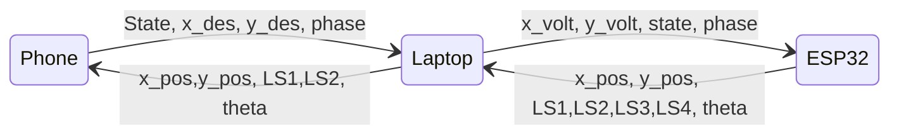

# Soft Serve shipping

[toc] 

# High level functionality

## Project Goals

Soft Serve Shipping aims to stabilize a shipping container crane using real time programming for the ME135 class. The project CAD can be found here <LINK>. Our mini-shipping crane will allow the user to move a gantry in the x direction, and use a reel to control the height of the shipping container. There are two slots for the container in the base of the crane, corresponding to a 'start' and 'end' position. 

The user will be able to select either an 'automatic' or 'manual' mode. In manual mode, the user is timed on how quickly they can move the container from the start to end positions using a joystick. In the automatic mode, our program is timed performing the same task. All times will be shown on a phone screen after the run is completed.

## Device functionality at a glance

We have three devices running software: a laptop, a phone, and an ESP32. The main functionality of each device is set out briefly below. 

### Phone

- The phone contains the only GUI in this project. It is how the user interacts with the logic of the system. The only other user input is the joystick connected to the ESP32
- The phone presents the user with a choice between 'automatic' or 'manual' , and then shows various data readouts whilst the player or machine performs a run
- In automatic mode, the phone also takes a user input for a desired final position. Whilst this will be defaulted to the 'end' position marked in the crane's base, we will let the litigious types in the room prove for themselves that we didn't hard code one path
- The phone sends the state variable ('automatic' or 'manual') to the laptop each run, as well as the desired final location in automatic mode. The phone recieves various positional data from the laptop for the data readout. 

### ESP32 

- Regardless of mode, the three primary functions of the ESP32 are: to pull sensor data (X encoder, Y encoder, 4 x Limit Switches, roatary encoder), to send this data to the laptop, and to actuate on motors with a variable PWM value
- In automatic mode, the ESP32 recieves PWM values from the laptop
- In manual mode, the ESP32 maps the PWM value linearly to the joystick input

### Laptop

- Regardless of mode, the laptop: reads the state variable (automatic or manual) from the phone, passes it to the ESP32, continually sends positional data to the phone for data readout, and reads this positional data from the ESP32
- In automatic mode, the laptop also computes and sends PWM values for the ESP32
 
.

A block diagram showing basic communication flow is shown below.

_Created 3/13/23, Auth: Sam Phillips_

**------------------Update log ------------------**
- 3/13/23: Added First draft of block diagram using mermaid feature: https://mermaid.js.org/syntax/stateDiagram.html. Added main body text

**--------------------------------------------------**

# Documentation

This section gives a detailed breakdown of how the project works.

It should be updated every time an update is made to the software.

**It should be updated every time an update is made to the software.**

Please see the README section at the bottom of this document for a guide on using markdown if it's unfamiliar to you!

_Created 3/13/23, Auth: Sam Phillips_
**------------------Update log ------------------**
- 3/13/23: Created 'phone, laptop and ESP32 software' tabs. Added list of functions for each category based on conversation from 3/12/23. 

**--------------------------------------------------**

## Phone functions

The phone will show a user interface. At the beginning of each run, the user will be able to select 'manual' or 'automatic' mode. During the run, whether automatic or manual, the phone will show a series of data readouts including current time of run, and maximum angle of displacement. At the end of the run, the GUI will show a short message and then go back to the first screen to select 'manual' or 'automatic' again.

The script for the laptop will be written in python. It will not be multithreaded.

### Variables
- int state = manual (0) or automatic (1) mode, set by user
- int x_des = desired final x location of container in automatic mode
- int y_des = desired final y location of container in automatic mode
- boolean LS1 = state of limit switch 1 (start condition)
- boolean LS2 = state of limit switch 2 (end condition)
- int pos_x = current position of container in X
- int pos_y = current position of container in Y
- int theta = current angle of deflection of cable
- int max_theta = maximum angle of deflection for current run
- int array max_theta_store = list of maximum angles of deflections for every run since startup
- int phase = 0 = container in start position, 1 = container in transit, 2 = container in end position
- float runTime = time of last run
- float array = times = list of all times since program startup

### startRun(times, max_angle_store)
- Starts GUI for user to select automatic or manual mode
- Displays fastest 5 times since startup and their corresponding maximum angle of deflection
- Output: ()

### Start server()
- Starts server to connect to laptop via AdHoc WLAN
- Output: ()

### readLaptop()
- Reads data from laptop via AdHoc WLAN
- Output:(LS1, LS2, pos_x, pos_y, theta)

### writeLaptop(state, x_des, y_des, phase)
- Writes data to laptop via AdHoc WLAN
- Output: ()

### getCurrentPhase(LS1,LS2)
- Returns current phase based on state of LS1 and LS2
- Helper function designed to assist state machine to implement functionality based on current location
- Output(phase)

### updateRun(pos_x, pos_y, theta)
- Updates GUI with new positional information and shows live timer for current run
- Updates max_theta if theta > max_theta
- Output: ()

### startTimer()
- starts timer - to be called when user begins run
- Output: ()
### endTimer()
- Ends timer - to be called when user finishes run
- Output: ()

### endRun(phase)
- Calls endTimer if phase = 2 (end position) and assigns duartion to runTime
- Shows message 'Thanks for playing! Your time was: MM:SS' for 3 seconds
- Adds runTime to times
- Adds max_angle to max_angle_store
- calls startRun(times, max_angle_store)
- Output: ()

_Created 3/13/23, Auth: Sam Phillips_
**------------------Update log ------------------**
- 3/13/23: Created list of variables and functions

**--------------------------------------------------**

## Laptop functions

The laptop reads and writes data to and from both the ESP32 and the phone. The laptop has different beaviour for the different states ( 0 = manual, 1 = automatic). Throughout both states, the laptop will read positional data from the ESP32 and write PWM voltages, state and phase values to the ESP32. In state 0, the laptop will write null values to the PWM values. In state 1, the laptop will compute PWM values based on the positional data provided by the ESP32 in the previous time step. 

The laptop code will be written in labview and will multithread using the timed loop function. The specific order of operations in this multithreading is yet to be finalized. 

### Variables
- int state = 0 for manual, 1 for automatic
- int phase = 0 = container in start position, 1 = container in transit, 2 = container in end position
- int x_des = desired final x location of container in automatic mode
- int y_des = desired final y location of container in automatic mode
- boolean LS1 = state of limit switch 1 (start condition)
- boolean LS2 = state of limit switch 2 (end condition)
- boolean LS3 = state of limit switch 3 (left X end stop)
- boolean LS4 = state of limit swtich 4 (right X end stop)
- int pos_x = current position of container in X
- int pos_y = current position of container in Y
- boolean watchDog = true if hit either endstop in X, false if not
- int theta = current angle position
- int PWM_x = PWM value for X motor
- int PWM_y = PWM value for Y motor

### read_ESP_data()
- Reads data from ESP32 serial connection
- Output(pos_x,pos_y,theta,LS1,LS2,LS3,LS4)

### write_ESP_data(PWM_x, PWM_y, state, phase)
- sends data to ESP32 via serial connection
- Output: ()

### read_Phone()
- Reads data from phone
- Output: (state, x_des, y_des)

### write_Phone(pos_x, pos_y, LS1, LS2, theta)
- Writes data to phone
- Output: ()

### calculate_dynamics(pos_x,pos_y,theta,check_Watchdog,x_des,y_des)
- Calculates PWM values based on physical model and sim
- Output: (PWM_x, PWM_y)

### check_Watchdog(LS3,LS4)
- Changes flag watchDog to True if LS3 or LS4 are hit
- Output: (watchDog)

_Created 3/13/23, Auth: Sam Phillips_
**------------------Update log ------------------**
- 3/13/23: Created list of variables and functions

**--------------------------------------------------**
## ESP32 functions

The ESP32 will have different functionality based on the state (0 = manual, 1 = automatic) and the phase. The ESP32 will both upload positional data to the laptop and read state data from the laptop throughout all processes. 

When the phase is 2 (container in end position) the ESP32 will begin a homing sequence to reset the container back to the start (it will also clear the serial buffer of any junk). During phases 0 and 1 (container in start position or during the run) the ESP32 will control the motors. In state 0 (manual) the ESP32 simply linearly maps the joystick values to PWM values for X and Y. In automatic mode, the ESP32 recieves PWM values from the laptop.

The ESP32 will be multithreaded, and the exact order of operations is yet to be decided on.

### Variables
- int PWM_x = PWM value for x motor
- int PWM_y = PWM vlaue for y motor
- int state = 0 for manual, 1 for automatic
- int phase = 0 for container in start position, 1 for during the run, and 2 for container in end position
- int pos_x = current x position
- int pos_y = current y position
- boolean LS1 = state of limit switch 1 (start condition)
- boolean LS2 = state of limit switch 2 (end condition)
- boolean LS3 = state of limit switch 3 (left X end stop)
- boolean LS4 = state of limit swtich 4 (right X end stop)
- int theta = current angle from rotary encoder
- int joy_x = current position of joystick in x
- int joy_y = current position of joystick in y
- boolean homed = True if homed, false if not
- boolean watchDog = True if LS 3 or 4 are hit (i.e. if gantry is at X end stop)

### readLaptop()
- Reads values from laptop serial connection
- Output(PWM_x, PWM_y, state, phase)

### switchCase(state, phase, homed)
- Calls appropriate functions based on state, phase, and homed (i.e. drives a state machine)
- Output: () 

### getPosXY()
- Reads encoder pins and returns x and y positions
- Output: (pos_x,pos_y)

### getAngle()
- Reads rotary encoder pins and returns angle
- Output: (angle)

### checkLimswitches()
- Reads limit switches and returns array of booleans
- Output: (LS1, LS2, LS3, LS4)

### readOrientaion()
- Calls getPosXY(), getAngle(), checkLimSwitches()
- Output: (pos_x, pos_y, angle, LS1,LS2,LS3,LS4)

### writeOrientation(readOrientation)
- Sends Orientation to laptop
- Output: ()

### readJoystick()
- Returns X and Y position of joystick
- Output: (joy_x, joy_y)

### manualActuate()
- Calls readJoystick()
- Linearly maps PWM_x and PWM_y to joysttick values
- Output: (PWM_x, PWM_y)

### autoActuate()
- Returns PWM x and y values from readLaptop()
- Output: (PWM_x, PWM_y)

### writeMotors(PWM_x,PWM_y, checkwatchDog(LS3,LS4))
- Applies PWM voltages to X and Y motors
- sets PWM to 0 if watchDog = true
- Output: ()

### CheckwatchDog(LS3,LS4)
- Returns watchDog as True if LS3 or 4 are  (i.e. if the gantry has hit an endstop, else returns false
- Output: (watchDog)

### home()
- Homes the system to the start position
- sets homed = True
- Output: (homed)

_Created 3/13/23, Auth: Sam Phillips_
**------------------Update log ------------------**
- 3/13/23: Added variables and functions

**--------------------------------------------------**

# README
## Team instructions go here
### Update this at end!!
Put information here!

I'm so sorry I'm so tired rn but there's a guide when you create a hackMD account and I'll try to add more here tomorrow

_Created __/__/__, Auth: YOURNAME_
**------------------Update log ------------------**
- __/__/__: LOG CHANGES HERE

**--------------------------------------------------**

