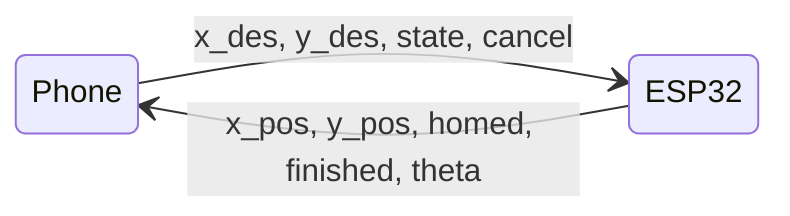
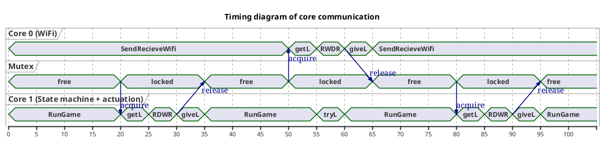
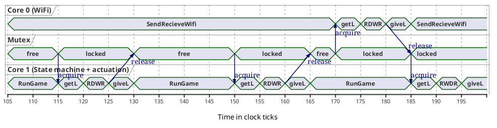
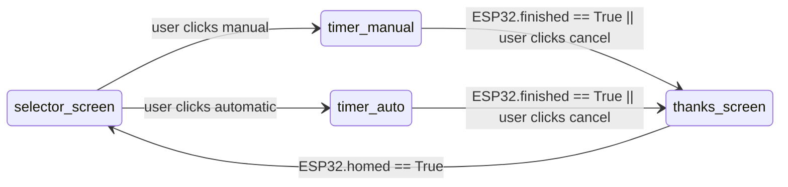
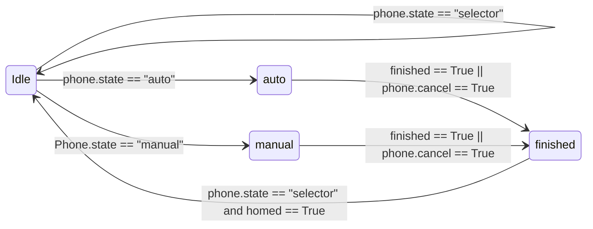

# Soft Serve shipping

[toc]  

# Introduction

SoftServeShipping is an automated crane system designed for the "Design of Microprocessor based mechanical systems" (ME135) class at UC Berkeley.

Project authors: Joy (Tzuyi) Chang, Sam Phillips, Ziven Posner, Tijmen Sep

# High level functionality

## Project Goals

Soft Serve Shipping aims to stabilize a shipping container crane using real time programming for the ME135 class. The project CAD can be found here <LINK>. Our mini-shipping crane will allow the user to move a gantry in the x direction whilst recieving a live data readout of the swing angle of the attached container. There are two slots for the container in the base of the crane, corresponding to a 'start' and 'end' position. 

The user will be able to select either an 'automatic' or 'manual' mode. In manual mode, the user is timed on how quickly they can move the container from the start to end positions using a joystick. In the automatic mode, our program is timed performing the same task. All times will be shown on a phone screen after the run is completed, alongside a printout of the maximum angle of swing of the container during the run. 

## Device functionality at a glance

We have two devices running software: a phone (Moto G7 Power, Android 10) and an ESP32. The main functionality of each device is set out briefly below. 

### Phone

- The phone contains the only GUI in this project. It is how the user interacts with the logic of the system. The only other user input is the joystick connected to the ESP32
- The phone presents the user with a choice between 'automatic' or 'manual' , and then shows various data readouts whilst the player or machine performs a run
- In automatic mode, the phone also takes a user input for a desired final position. Whilst this will be defaulted to the 'end' position marked in the crane's base, we will let the litigious types in the room prove for themselves that we didn't hard code one path
- The phone sends the state variable ('automatic' or 'manual') to the ESP32 each run, as well as the desired final location in automatic mode. The phone recieves various positional data from the ESP32 for data readouts. 

### ESP32 

- Regardless of mode, the three primary functions of the ESP32 are: to pull sensor data (X encoder, Y encoder, 4 x Limit Switches, roatary encoder), to send this data to the laptop, and to actuate on motors with a variable PWM value
- In automatic mode, the ESP32 continously computes actuation parameters from the control equation created in MATLAB and current state.
- In manual mode, the ESP32 maps the PWM value linearly to the joystick input

A block diagram showing basic communication flow is shown below.

## Multithreading & multitasking

### Why multitask?

- The ESP32 needs to perform three high-level tasks:
    - Perform two way wireless communication with the phone 
    - Take sensor input from two limit switches, two hall effect sensors, potentiometer, and encoder 
    - Update state machine based on the recieved data from the phone and sensors
- During testing, we found our incremental encoder (used to detect X position) was skipping edges, hence giving inconsistent values run to run.
- Professor Anwar suggested this was due to delays introduced by wifi communications
- To solve this issue, we decided to break the wifi comunications out onto a sepearate core from the rest of the operations

- As per the diagram above, taken from the ESP32 Feather spec sheet, the ESP32 has two cores with a shared SRAM and ROM

### Our approach

- We used the first core to read sensors and tracks the state machine, whilst the second core send and recieve data over wifi
- The wifi operations run on Core1 
- Sensor readings, and state machine are handled in Core0
- Core0 (the state machine) needs to access values sent to Core1 from the phone
- Core1 (wifi) needs to send sensor values to the phone for data readout 
- To avoid read/write conflicts in SRAM between the cores, the two cores send and recieve data from the other through the use of a Mutex.
- The wifi operations take ~5-8 times longer to run than the state machine code we wrote, hence Core0, which reads the encoder, can run multitple times before it updates values from Core1.
- The diagram below shows a visualition of this process flow

- The above diagram shows the interaction between the two cores and the Mutex
- There are 8 values shared between the two cores (int x_pos, bool homed,bool finished, int theta, int x_des, int y_des, const char* state, bool cancel)
- There are three version of each of these variable. One for core 0, one for core 1, and one for shared (e.g. there is x_pos_core0, x_pos_core1,x_pos_shared)
- Outside of the acquire mutex statement, each core only accesses its own version of the variable (e.g. core0 only uses x_pos_core0)
- Inside the acquire mutex statement, each core updates the '_shared' version of the variable

### Evaluating multitasking success

- When we ran both wifi and sensor readings on the same core, we could not get consistent data
    - In one run, the entire length of our gantry would read as 2000 encoder ticks, whilst on the next run it would only register 200
- When we split the wifi out onto a second core, our readings became incredibly consistent
    - The length of our grantry was measured as 5030 encoder ticks. Across 10 tests, this value only varied between 5029 and 5032, which corresponds to a total physical error of ~0.5cm. 
- Hence multitasking was able to solve our problem of innaccurate encoder readings

# Github file structure

- Phone 
    - phone_classes
        - main.py
        - automatic_frame.py
        - manual_frame.py
        - select_frame.py
        - thankyou_frame.py
        - scoresTable.py
        - swingAnimation.py
        - timer.py
        - gamePlayer.py
    - src
        - phoneFunction1.py
        - phoneFunction2.py
        - ...
- ESP32
    - ESP32_classes
        - main
            - main.ino
        - libraries
            - actuator.h
            - actuator.cpp
            - esp32.h
            - esp32.cpp
    - src
        - MATLAB
            - Contains MATLAB scripts for initially designing controller
        - Arduino
            - Contains deprecated scripts for main/libraries
        - MicroPython
            - Contains deprecated micropython implementations
- Deprecated
    - deprecatedFunction1.py
    - deprecatedFucntion2.py
    - ...
- README.md

README.md is a copy of this document (which is linked top github through Hackmd). 

The 'phone_classes' and 'ESP32_classes' contain the most up-to-date files needed to run our project. 

Main.ino is the main script to be run on the ESP32. The libraries folder contains two arduino libraries we wrote that main.ino requires. 'Actuator' handles reading and writing to physical devices, whilst 'esp32' handles wifi communications and runs the state machine for the ESP32 side of the project.

Main.py is the main script to be run on the phone. The other files in the 'phone_classes' folders are python classes we wrote that main.py requires to run. 

The src folders were only for use during development, and contain various unit functions that the dev team needed to share with eachother. 

The deprecated file contains all deprecated materials from before we decided on our final devices and file structure. The most major change in development was the removal of a third device, a laptop. The laptop was intedned to perform multithreading via labview, but we realized that it made little sense to artificially add multithreading into the system, and decide to multithread on the ESP32 instead. 

# Phone Functionality

The phone will show a user interface. At the beginning of each run, the user will be able to select 'manual' or 'automatic' mode. During the run, whether automatic or manual, the phone will show a series of data readouts including current time of run, and maximum angle of displacement. At the end of the run, the GUI will show a short message and then go back to the first screen to select 'manual' or 'automatic' again.

The phone runs python files on a linux distribution called Termux. Termux operates a GUI using the tKinter python library, and VNC viewer as it does not have a graphical interface itself.

The Phone controls a state machine which follows the logic in the diagram below:

The selector screen presents the user with a choice of automatic or manual, as well as showing a score table of the best times so far.

The timer_manual screen shows a timer as the user performs a run, as well as the current angle and maximum angle of deflection.

The timer_auto screen shows a timer as the machine performs a run, as well as the current angle and maximum angle of deflection.

The thanks_screen is presented after the user finishes a run, and shows the time for their run. It holds this screen whilst the machine homes itself, and then goes back to the selector screen. 

## Setup:

- Open Termux
- Run: cd SoftServeShipping/phone/phone_classes
    - This takes you into a virtual environment that has all the correct packages installed
- Run: vncsevrer -localhost -geometry 768x1366 
    - This sets up a vncserver. Termux has no GUI, so we use VNCserver as a GUI
    - If error, run: vncserver -kill ":1" and then try the above command again
- Run: export DISPLAY=':1'
- Run: python main.py
- Open VNC viewer app

## Classes overview
#### gamePlayer
##### Variables:
- boolean cancel (for cancel button on GUI and to send to ESP32)
- int x_des (set by user input in auto mode)
- int y_des (set by user input in auto mode)
- float lastRuntime (for use by timer)
- int maxTheta (maxTheta for current run for scoring)
- string state (current state)
- string lastState (last state)
- int x_pos (current x position recieved from ESP32)
- int y_pos (current y position recieved from ESP32)
- boolean homed (flag to detect if machine is homed recieved from ESP32)
- boolean finished (flag to detect if run has finished recieved from ESP32)
- int theta (current angle of swing in deg)
- timer runTimer() (instance of the runTimer() class described below)
- dictionary frames (dictionary used to keep  track of frames)
- tk.Frame container
- tk.Frame select_frame (frame to show select screen)
- tk.Frame manual_frame (frame to show manual screen)
- tk.Frame automatic_frame (frame to show automatic screen)
- tk.Frame thankyou_frame (frame to show thankyou screen)
- int[] scoreArr (array to track scores)
- String name (name for score arr, taken from select screen)
- int width (width of GUI in pixels)
- int height (height of GUI in pixels)
##### Functions
- init(self) (creates instance class)
- getState(self) (selects correct state based on state machine diagram)
- buttonState(self,buttonState) (Sets state -called when you press a button on the GUI so the GUI can edit the state machine)
- actions(self) (actuates on motor and edits variables based on current state)
- chooseFrame(self) (raises appropriate frame depending on state)
- show_frame(self,page_name) (helper function for chooseFrame())
- updateMaxTheta(self) (updates maxTheta value during a run)
- updateScoreArr(self,lastName,lastTime,lastMaxTheta) (updates scoreArr each run)
- setCancelTrue(self) (sets cancel flag true)
- setCancelFalse(self) (sets cancel flag false)

#### select_frame
##### Variables:
- String name (name of frame for frames dictionary in gamePlayer class)
- frame parent (parent tk.Frame)
- frame controller (controller tk.Frame)
- tk.Label label (Title text label)
- tk.Label label2 (Main text label)
- tk.Entry nameEntry (text entry box for user name in manual mode)
- tk.Entry xdesEntry (text entry for desired x position in auto mode)
- tk.Button button1 (button to select manual mode)
- tk.Button button2 (button to select automatic mode)
- scoresTable table (creates instance of our scores table class described below)
##### Functions
- init(self,parent,controller) (creates instance of frame)
- update(self,time) (updates score array)

#### manual_frame
#### Variables:
- String name (name of frame for frames dictionary in gamePlayer class)
- frame parent (parent tk.Frame)
- frame controller (controller tk.Frame)
- tk.Label label (Title text label)
- tk.Label label2 (Main text label)
- tk.Label timerLabel (label to show current time)
- tk.Label theta (label to show current swing angle)
- tk.Button button1 (Cancel button if user wants to exit before finishing)
- SwingAnimation Swinganim (tk.Canvas subclass we wrote to show the current angle of swing as a graphic)
#### Functions:
- init(self,parent,controller) (creates instance of frame)
- update(self,time) (Updates values for timer, theta, swingAnim)

#### automatic_frame
##### Variables:
- String name (name of frame for frames dictionary in gamePlayer class)
- frame parent (parent tk.Frame)
- frame controller (controller tk.Frame)
- tk.Label label (Title text label)
- tk.Label label2 (Main text label)
- tk.Label timerLabel (label to show current time)
- tk.Label theta (label to show current swing angle)
- tk.Button button1 (Cancel button if user wants to exit before finishing)
- ImtagwTk img (logo to display on this frame)
- tk.Label imglabel (tk label object so display logo image)
##### Functions:
- init(self,parent,controller) (creates instance of frame)
- update(self,time) (Updates values for timer, theta)

#### thankyou_frame
##### Variables:
- String name (name of frame for frames dictionary in gamePlayer class)
- frame parent (parent tk.Frame)
- frame controller (controller tk.Frame)
- tk.Label label (Title text label)
- ImtagwTk img (thankyou image to display on this frame)
- tk.Label imglabel (tk label object so display thankyou image)
##### Functions:
- init(self,parent,controller) (creates instance of frame)
- update(self,time) (Empty, no values to update on this screen)

#### tk.Frame ScoresTable
##### Variables:
- frame parent (parent tk.Frame)
- tk.ttk.Treeview tree (tkk treeview object to format table)
- tk.Scrollbar scrollbar (scrollbar object attached to tree) 
##### Functions:
- init(self) (creates instance of frame)
- update_scores(self,scores) (updates tree diagram to include 'scores')

#### tk. Canvas swingAnimation
##### Variables: 
- frame parent (parent tk.Frame)
- int width (width and height of canvas in pixels)
- int armLength (length of swing arm in pixels)
- int[] arm_coords (initial coordinates of arm as (x0,x1,y0,y1))
- int[] line0 (current coordinates of arm as (x0,x1,y0,y1))
- ImageTk img (image of container)
##### Functions
- init() (Creates instance of class)
-  getFinalCoords(self,theta) (returns final coordinates of swing arm after rotation by theta)
-  rotateDisplacePoint(self,points,theta) (helper function for getFinalCoords )
-  drawContainer(self,theta) (redraws canvas to show new location of container after rotation by theta, calls getFinalCoords())
-  show(self) (raises canvas to top of frames so it is visible)
-  hide(self) (lowers canvas to bottom of frames so it is not visible)

#### timer()
##### Variables:
- float time (current time in seconds)
- float startToSubtract (start time of run for calculating duration of run)
##### Functions:
- init(self) (creates instance of timer class)
- startTimer() (sets timeToSubrtract to current time)
- resetTimer() (sets timeToSubtract to 0)
- getTime() (subrtracts timeToSubtract from currentTime and returns result)
- getTimeString() (returns getTime as string formatted "MM:SS")

# Wifi communication 

## Phone wifi communication

The phone and ESP32 communicate using ad-Hoc WLAN. The ESP32 connects to the phone's hotspot. The phone uses the python sockets package to send data between the two devices. Data is encoded and stored in a JSON file

- start_server()
    - Creates a socket (sock) with server address and port: '192.168.43.1', 12345
    - returns connection after calling sock.accept()

- send_data(sock, x_des, y_des, state, cancel):
    - Stores variables x_des, y_des, state, cancel in json dump, encodes message using .encode() and sends message to ESP32 using sock.sendall()

- recieve_data(sock,game)
    - recieves data using sock.recv as a json dump
    - Decodes json dump and assigns values to game.x_pos, game.y_pos, game.homed, game.finished, and game.theta accordingly.

## ESP32 wifi communication

The ESP32 recieves data using the <WiFi.h> package and encodes and decodes JSONs using version 5 of <ArduinoJson.h> (current version 6 as of 5/3/22). 

- void phone_connect()
    - Connects to phone wifi hotspot

- start_client()
    - Returns: WiFiClient client 
    - Called once on startup

- recieveData(WiFiClient client)
    - Recieves data and assigns new x_des, y_des, phone_state and cancel to ESP32 object
    - Called once per core0 loop

- send_data(int x_pos,bool homed,bool finished,int theta, WiFiClient client)
    - Sends x_pos, y_pos, homed and finished to phone using the sock socket
    - Called once per core0 loop

# ESP32 functionality

The ESP32 will both upload positional data to the phone and read state data from the phone throughout all processes. 

The ESP32 will operate on a state machine as shown below:

Where the diagram shows 'phone.state == "XXXXXX"', this corresponds to the user pressing a button on the phone. The phone then updates the 'state' variable which it is continously sending to the ESP32. 

Where the diagram shows 'finished == True' or 'homed == True' this corresponds to the flags that the ESP32 is updating itself and continously sending to the phone. It is up to the ESP32 to detect when these conditions should be set to True or False.

The ESP32 sends and recieves data from the phone in all states. 

In Idle mode, the ESP32 will not actuate on the motors at all.

In manual mode, the ESP32 will read the joystick values, and linearly map the PWM voltage of the two motors to the X and Y joystick values. Once the 'finished' flag is set to true, or if the user presses cancel on the phone, the state changes to 'finished' 

In automatic mode, the ESP32 will run a control loop to move the container as fast as possible whilst minizing the angle of swing of the container. Once the 'finished' flag is set to true, or if the user presses cancel on the phone, the state changes to 'finished' 

In finished mode, the ESP32 will reset the finished flag and begin a homing sequence. Once the homing sequence is finshed, it will pass the state back to Idle mode to wait for the next game.

## Classes overview

### ESP32()
##### Variables:
- actuator myActuator (instance of custom class actuator, detailed below)
- string state (crurent state)
- string phone_state (current phone state, recieved via wifi)
- volatile int x_pos (current x_pos, read from encoder)
- volatile int theta (current theta, read from potentiometer)
- bool finished (state machine flag, set true when end sensor on)
- bool homed (state machine flag, set true when homing completed)
- bool cancel (state machine flag, recieved from phone via wifi)
- int x_des (desired x position, recieved from phone via wifi)
- 

##### Functions
- init() (Creates Instance of class)
- getstate() (changes ESP32 state based on recieved phone_state and finished conditon)  
- actions() (Actuates motors and sets variables according to state machine)
- bool checkFinished() (Check if end sensor is true with ~1 second debounce)
- bool checkHomed() (checked if homing function has run)

### actuator
##### Variables:
- Pin LS1 - Limit switch 1 
- Pin LS2 - Limit switch 2
- Pin startSensor - start hall effect sensor
- Pin endSensor - end hall effect sensor
- Pin IN1 - Gantry motor pin
- Pin IN2 - Grantry motor pin 2
- int maxMotorPower 
- int speed_as_percent
- PWM motor 
- PWM rev_motor
- Pin button - Joystick button input
- ADC xStick - Joycon X stick input
- ADC yStick - Joycon y stick input
- int minJoy - manually callibraed joycon constant
- int deadBand - manually callibraed joycon constant
- int maxJoy - manually callibraed joycon constant
- int centerJoy - manually callibraed joycon constant
- int slope - manually callibraed joycon constant
- Pin pinA - gantry encoder pin 
- Pin pinB - gantry encoder pin
- Pin prevA - last value of gantry encoder pinA
- Pin prevB - last value of gantry encoder pinB
- int encoder_pos - value for calculating encoder positon
- RotaryIRQ r
- int val_old - last value of r for use in calculating pos/speed
- int homingSpeed - device gantry moves during homing
- Bool leftHomed - set True when device in homed position
- Bool rightHomed - set True when device is in finished position
- Bool position - set True when desired position is reached for auto functions
- int tol - tolerance for final position when using auto functions
- const int angleSensor (potentiometer pin)
- float center (callibration value to set 0 point of potentiometer to be vertical)
- const float oneDegInCounts (manually callibrated value to convert potentiometer ticks to degrees) 
- const int debounceTime (debounce time for end sensor)
- volatile int debounceCounter (counter to track how many runs have occured during debounce)
- float[] medianArray (temporary array for finding median for reducing potentiometer noise)
 - const float kpt (Controller P constant for theta) 
  - const float kdt (Controller D constant for theta)
  - const float kpx (Controller P constant for x) 
  - const float kdx (Controller D constant for x)
  - const float dt (time step set by machine clock speed)
  - float x_past (previous x value)
  - float th_past (previous theta value)
  - float PWM (current PWM value)
  - float totalEncoder(Length of gantry in encoder ticks)
  - float totalLength (Length of gantry in meters)

##### TODO: Functions:
- init() (Sets up pins and other required values for sensing and actuation)
- bool() checkLimLeft() (checks left limit switch)
- bool checkLimRight() (checks right limit switch)
- float medianArray(float array[]) (returns median value of array)
- shiftArray(float array[], float newValue) (inserts newValue into array, replacing the least recently updated value once the array is filled)
- bool checkStart() (checks if left hall effect sensor on)
- bool checkEnd() (checks if right hall effect sensor on)
- void writeMotors(int PWM) (writes PWM to motors, checking for limit switches and PWM boundaries)
- void manualMovement() (moves gantry based on joystick input)
- bool homingFunciton (homes and returns true when complete, false otherwise)
- void autoMove(float x_des) (moves to x_des using Tijmen's controller)
- bool moveToPosition(int xcoord) (Moves to xcoord using basic bang bang controller, ignoring angle of swing)
- float getTheta() (reads potentiometer for swing angle)
- void callibratePot() (callibrates potentiometer to set 0, called once during setup)

    
    
